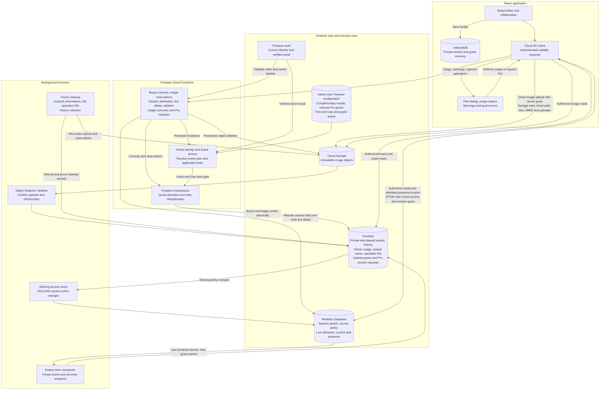
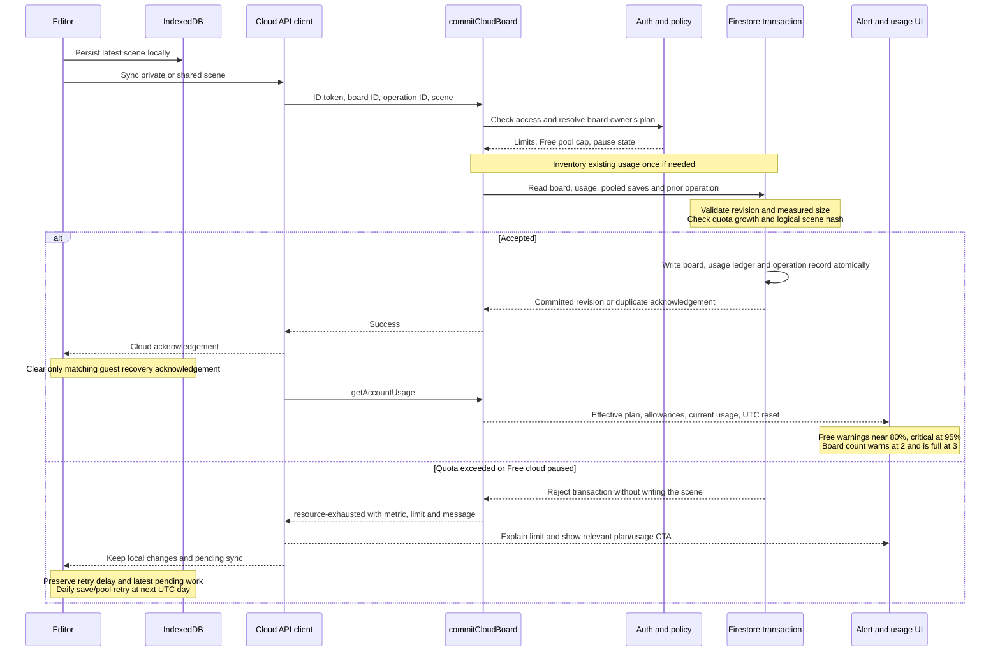
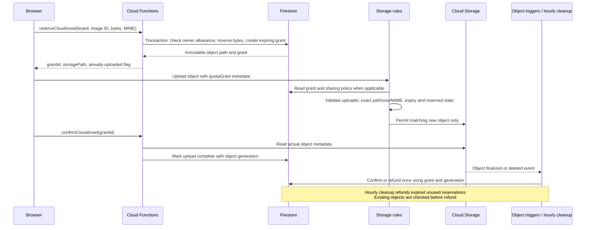

# Freemium architecture

This describes the implemented workspace changes. Eight freemium callable Functions are deployed to dev for live validation, and the local app runs on port 15176 against real dev Firebase. The hosted application, restrictive rules and new background jobs remain undeployed; existing dev project-sharing rules/triggers were preserved for other worktrees. Production is unchanged. The complimentary list is configured in both dev and prod. Each environment has its own Firebase resources and configuration.

Dev additionally has the narrow own-session-grant read/deletion rule needed for live disconnect cleanup. Existing RTDB rule nodes were preserved; the remaining freemium rules are still pending rollout.

## System diagram

The Functions layer is authoritative for board ownership, entitlements and quota allocation. Clients cannot directly write board scenes, usage counters, upload grants, admin configuration or live elements. Authorized board/image reads and project metadata writes remain direct SDK operations. Cursor and presence writes remain direct RTDB operations after session admission.

## Board save and alert flow

Authentication, access checks and the operator pause can reject before the transaction. Image uploads are completed and validated before a scene referencing them is accepted. Guest/shared activity is attributed to the board owner. A private and shared copy of the same logical scene counts once; both actual document copies and image objects contribute their retained bytes.

## Image reservation flow

Reservations count immediately, preventing concurrent uploads from exceeding the owner's image allowance. Retries reuse immutable image IDs. Permanent board deletion revokes grants before removing objects, refunds remaining grants after successful object deletion, deletes live state and history, then releases the board slot. It also cleans up uploaded images when the board's initial cloud commit failed.

## Implementation map

| Responsibility                                                                             | Implementation                                                        |
| ------------------------------------------------------------------------------------------ | --------------------------------------------------------------------- |
| Authenticated callable client, usage/quota events, size estimate and retry timing          | `apps/whiteboard/src/features/account/cloud-api.ts`                   |
| Usage queries, Free/Pro dialog, request CTA, warning dismissal and complimentary badge     | `apps/whiteboard/src/features/account/account-panel.tsx`              |
| Private local outbox, revision conflict reconciliation and five-second cloud write spacing | `apps/whiteboard/src/features/workspace/workspace-api.ts`             |
| Shared scene commits, session registration and disconnect cleanup                          | `apps/whiteboard/src/features/sharing/sharing-service.ts`             |
| Durable guest recovery cache with acknowledgement matching                                 | `apps/whiteboard/src/features/sharing/guest-recovery.ts`              |
| Upload reservation and immutable image transfer                                            | `apps/whiteboard/src/features/assets/scene-assets.ts`                 |
| Server-mediated live deltas, element warnings and admitted presence                        | `apps/whiteboard/src/features/collaboration/collaboration-service.ts` |
| Local save/recovery integration, quota retries and cloud-size display                      | `apps/whiteboard/src/routes/board-editor.tsx`                         |
| Plan limits, UTC periods and measured Firestore document size                              | `functions/src/usage-policy.ts`                                       |
| Entitlements, inventory, transactions, uploads, session admission, deletion and retention  | `functions/src/account-usage.ts`                                      |
| Access-policy mirror and abandoned-room recovery trigger                                   | `functions/src/index.ts`                                              |
| Direct-write prevention and upload/session authorization                                   | `firestore.rules`, `storage.rules`, `database.rules.json`             |

`requestProAccess` only records a verified user's request in Firestore. An administrator must grant access through `accountEntitlements/{uid}` or the complimentary email list; no checkout or payment processor is connected.

The Free pool is an application save allowance, not a Firebase billing meter or hard spending cap. Its default is 2,000 logical saves per UTC day; manually granted and complimentary Pro have separate pooled counters. Exact per-user download metering, payment integration, monetary budget automation and the economics agent remain deferred. Local editing, export and local MCP remain free.

See [limits, validation and deployment order](../plans/freemium-rollout.md).
