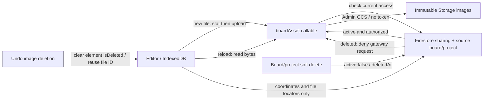

# Image upload persistence

The editor previously saved image elements without Excalidraw's separate binary-file map. Reloading restored an element's `fileId` but none of its bytes. Firebase Storage was initialized and had a standalone upload helper, but the editor's persistence path did not use it.

The editor now captures the third `onChange` argument (`files`), saves it in the local IndexedDB scene, and supplies it to `initialData.files`. Board copies, previews, SVG exports, scene reconciliation, and transitions from collaboration retain the files. Optional `scene.files` preserves compatibility with older documents. Deleted elements retain their files for undo.

Cloud writes upload image bytes before committing scene references. Private workspace assets use `users/{uid}/boards/{boardId}/assets/{fileId}`; shared assets use `boards/{boardId}/assets/{fileId}`. Project/board publication retains existing private-root image locators. The gateway applies the board’s current direct and inherited project permissions to those locators; new images on a shared board use the shared path. Sharing policy changes go through the project feature’s existing callables and do not rewrite scene snapshots. Firestore stores file metadata and `storagePath`, with an empty `dataURL`, so image bytes do not consume its document-size budget. Reads now use the authorized `boardAsset` callable and hydrate data URLs before rendering; browser Storage access is denied. See [ADR 003](../decisions/003-image-access-and-soft-delete.md). Shared snapshots also deliver assets to active collaborators.

Image IDs identify immutable content. A restored Storage path acts as a durable upload receipt. If a local file has no receipt, the first sync checks object metadata and uploads only when the object is absent. Concurrent saves are deduplicated within the browser session. Existing image movement changes element coordinates/version, never the stored image bytes. Known image bytes are reused when receiving element-only snapshots. The editor no longer reads a share document to establish its existence on every move. Upload failures reject the cloud save; local bytes remain available for retry. Images at or above 10 MiB are retained locally but cannot sync. Assets are retained for undo and soft-delete restoration. No automatic garbage collection is configured. Board/project tombstones revoke further gateway access while retaining bytes.

## Original deployment (superseded for image access by hardening below)

1. Enable a Firebase Storage bucket for the target project and set `VITE_FIREBASE_STORAGE_BUCKET` to its exact name in the relevant app environment.
2. Deploy `storage.rules` with `firebase deploy --only storage --project YOUR_PROJECT_ID`. Private workspace paths require their owner; shared paths follow the board's access policy.
3. Configure the bucket's CORS policy to allow `GET` from the deployed app origins and any development origins. Direct SDK browser downloads require bucket CORS configuration ([Firebase documentation](https://firebase.google.com/docs/storage/web/download-files#cors_configuration)). Example configuration:

   ```json
   [{ "origin": ["https://YOUR_APP_ORIGIN", "http://127.0.0.1:5173"], "method": ["GET"], "maxAgeSeconds": 3600 }]
   ```

   Save this as `cors.json`, then apply it with `gsutil cors set cors.json gs://YOUR_BUCKET_NAME`.

4. Build and deploy the updated app. Keep existing Firebase Auth and App Check configuration valid for the deployed origin.

Old scenes whose image bytes were never saved cannot reconstruct them from `fileId`; reinsert those images once after this fix.

## Verification

The current cloud command is `pnpm test:images:cloud`, which builds Functions and starts Auth, Firestore, Storage, RTDB, and Functions emulators. `node tests/image-access-policy.test.mjs` checks owner, verified-email invite roles, public roles, and tombstones.

- `node tests/image-persistence.test.mjs`: real editor save/reload against IndexedDB with Firebase disabled. Failed before the fix because the restored image data was undefined.
- `firebase emulators:exec --only auth,firestore,storage --project demo-image-persistence --config image-persistence.firebase.json 'node tests/image-persistence.test.mjs --cloud'`: private workspace cloud sync and shared-board upload/download, Firestore metadata-only storage, denied private reads by another identity, and rejection of missing upload bytes.
- `pnpm check`: TypeScript checks for all workspace packages.

## Deployment audit and movement regression

Run `pnpm check:images:deployment` for a read-only audit using the existing Firebase and gcloud CLI credentials. The recorded results are in `image-deployment-status.json`. The Firebase CLI account can access both aliases; development and production are separate projects, not separate Google logins.

The initial audit found missing Storage buckets in both projects and missing development hosting. Both projects have now been provisioned with separate default buckets in `ASIA-SOUTH1` (Mumbai), explicit CORS, deployed Storage rules, and updated hosting. Firestore and RTDB rules match this repository in both environments.

Provision each project's Firebase default Storage bucket in the Firebase Console (Storage → Get started), choose the intended location, and verify its name matches the relevant environment file. Configure separate CORS origins for each bucket:

- Development: `https://open-excalidraw-dev-2.web.app`, `https://open-excalidraw-dev-2.firebaseapp.com`, `http://localhost:5173`, `http://127.0.0.1:5173`.
- Production: `https://open-excalidraw-b2ab4.web.app`, `https://open-excalidraw-b2ab4.firebaseapp.com`, plus any actual custom app domain.

After provisioning and CORS, deploy the changed Storage rules and app separately by project:

```sh
pnpm check
pnpm --filter @agentic-whiteboard/whiteboard exec vite build --mode development
firebase deploy --only storage,hosting --project development
pnpm --filter @agentic-whiteboard/whiteboard build
firebase deploy --only storage,hosting --project production
```

There is no requirement to redeploy unchanged Firestore/RTDB rules or Functions for the movement fix. Validate Storage's Firestore-based access checks when deploying shared-board rules, and smoke-test the development bucket before production.

The added Puppeteer coverage exercises the actual toolbar's HTML file-input fallback, placement, and reload. The cloud suite inspects Storage network requests: exactly one initial upload per private/shared path, zero reuploads for movement after a page reload, and real mouse drags in the shared editor with zero upload/download calls. Position writes are verified in Firestore. This caught a regression in the initial implementation: its memory-only upload cache reset on reload and uploaded an existing image again on the first move.

Canvas movement updates immediately. Durable scene writes remain debounced by 450 ms; private workspace cloud sync has a 150 ms debounce and a one-second write throttle. Those are existing scene-sync delays, independent of image uploads. Local IndexedDB still stores scene snapshots containing image bytes; separating local assets into their own collection would require a separate storage change if large-image profiling shows that snapshot serialization is slow.

## Earlier live rollout verification — 2026-10-03

Both Firebase projects use the existing `karanshah229@gmail.com` administrator login but retain separate Auth users, databases, buckets, rules, and hosting. Storage service agents also require `roles/firebaserules.firestoreServiceAgent` to evaluate the Firestore sharing policy. Non-interactive Firebase deployments skip the CLI's IAM prompt; the role was applied explicitly in each project. Allow time for IAM propagation before running shared-image tests.

Development: `node tests/image-persistence.test.mjs --live=development` passed private/shared round trips against the real services, denied private access for another user, metadata-only Firestore scenes, and actual editor movement with zero Storage image transfers. Local persistence and emulator suites also passed.

Production: tested the deployed editor in the existing signed-in Chrome session using a new verification board and a generated blue PNG. Upload, cloud sync, reload, and movement worked; the private Storage object's generation/metadata remained unchanged after movement. The automated localhost production run was blocked by App Check (`auth/firebase-app-check-token-is-invalid`); production protections remain enabled. The temporary localhost CORS origin was removed. This does not establish automated production access-control coverage.

The Chrome sharing test found that the editor's Share dialog omitted `scene.files`; service-level tests had not covered this handoff. The dialog now receives the complete file map, and the cloud browser suite verifies that Done produces a shared asset path.

Sharing also hydrates Storage descriptors before copying private images to the shared asset path. A descriptor with a matching path remains a valid upload receipt for position-only writes, even when inline bytes are absent. The regression suite covers this metadata-only movement case.

The uploader also accepts a descriptor from a different asset root: it checks the destination metadata first, reuses an existing object without transferring bytes, or hydrates the source and copies it only when needed. The private-to-shared regression starts from the actual metadata-only private Firestore scene.

The final Chrome reload uncovered local descriptors overwriting hydrated cloud bytes during scene reconciliation. The editor now hydrates the merged scene using known cloud files, and hydrates descriptor-only private scenes before initial rendering. E2E coverage explicitly persists an empty-inline-byte local scene, reloads the shared editor, and compares the rendered file map with the original PNG.

Final production verification passed in signed-in Chrome: the restricted shared scene restored its image after reload, a drag changed Firestore coordinates from `(760.000061, 359.010445)` to `(900.000061, 449.010445)`, and the Storage object generation/metadata stayed unchanged. Shared scene inline bytes remain empty. Both hosted bundles were checked for the correct Firebase project ID.

## Image access hardening and soft deletion — 2026-10-03

Architecture and integration contract: [ADR 003](../decisions/003-image-access-and-soft-delete.md).



Production's gateway enforces App Check; development uses Firebase Auth/board policy without mandatory App Check to permit the existing emulator and localhost tests. Direct image Storage reads, writes, metadata, and `getDownloadURL` are denied even for an owner. Uploads use the Admin GCS API, avoiding automatic Firebase download tokens. Previously issued tokens are revoked separately after deploying the new client and Storage rules. This does not change snapshot-path rules, Firestore sharing rules, or RTDB rules.

Deleted image elements retain their files for undo. Authorized active-board users can still read those retained files. A deleted board/project blocks further cloud byte transfers; restore clears the parent tombstone and reuses the existing objects. Existing browser copies remain available locally. The separate project-delete worktree must persist its tombstone using `active: false` or `deletedAt` in the existing cloud project document; this gateway does not implement its UI.

Deployment order for each explicit project: build Functions; deploy only `functions:boardAsset`; build the frontend for that environment; deploy Hosting and Storage rules; run `python3 tests/image-token-migration.py --project PROJECT_ID --apply`; then run live verification and the read-only deployment audit. The migration defaults to read-only, checks object generations are unchanged, preserves unrelated metadata, and reports counts without exposing tokens.

Development rollout verified: the real suite passed all movement, sharing, permission, tombstone, and restore checks. Revoked 26 legacy tokens without changing object generations; the old signed-out token URL returned 403. New gateway uploads had no tokens. Production rollout verified in signed-in Chrome on the separate `Image hardening — verification (2026-10-03)` board (`a7ff253d-a695-4cc8-960d-a3c573a90dd2`). Upload, private/shared reload, movement, persisted image deletion, Undo, and another reload passed. Revoked all four legacy production tokens; the old signed-out URL returned 401. New private/shared image objects have no download tokens. A request without App Check returned 401; Cloud Run logs confirmed Chrome requests had valid Auth and App Check. Local persistence, policy tests, TypeScript checks, and the emulator E2E suite passed. Emulator coverage includes real Share dialog/reload, zero byte transfers on movement, private/shared access, restricted/public viewer/editor policies, permission revocation, board/project soft-delete restoration, and denied direct Storage/token access.

The live development network test caught overlapping initial snapshot downloads: the shared subscription now seeds/reuses the editor's current file map and serializes hydration. The repeated real mouse-drag test then passed with zero image upload/download calls.

The production drag changed coordinates from `(810.000061, 369.010445)` to `(950.000061, 459.010506)` while both private/shared object generations and sizes stayed unchanged. The Delete action persisted `isDeleted: true` and retained the object. Undo cleared the tombstone and reused the same bytes. Reports and the screenshot are under `.system_generated/image-deployment/production-hardening-*`.

Functions environments must set `ASSET_ENFORCE_APP_CHECK=false` in development and `true` in production. The committed emulator-only environment has explicit regions and enforcement disabled, making the cloud test command reproducible without real credentials. Production's automated localhost run remains outside the App Check allowlist; the logged-in deployed Chrome test provides the production smoke coverage. Board/project permission and restore assertions ran in the emulator and real development services.

Operational note: development's Artifact Registry has no build-artifact cleanup policy. Firebase CLI returned a nonzero status after confirming successful function creation/update; the deployed gateway was independently verified as ACTIVE and tested. Choosing build-artifact retention is a separate operational follow-up. No Storage image expiration or deletion policy was added.

## Integration with first-class projects

The image-upload branch merges the first-class project sharing/deletion/export feature from `main`. `boardAsset` honors direct board grants and inherited project roles, verified email invitations, custom access overrides, and both board/project pending and deleted gates. Its owner/project location binding prevents a locator from claiming a different workspace. Authorized recipients can read published private-root images; private-root uploads remain owner-only. Direct Storage image access and token creation remain denied. Snapshot-path rules retain the project feature’s access policy.

An existing private-root locator for the same board is reused when saving a shared scene, so publication and the first subsequent move do not copy the image. Copying an image to a different board still checks/uploads the destination independently. Scene subscriptions serialize hydration and reuse known immutable bytes without removing the project feature’s access-recovery retries. The image client shares the callable/emulator connection with the project client, including its configurable port.

Owned workspace startup retains account isolation, metadata-only discovery, and one listener-based hydration pass. Deleted parents persist `sync-blocked`, retain pending local image bytes, and stop retries; restoration requeues them. The integration uses the project feature’s server-owned lifecycle writes and sharing callables rather than older direct client policy writes.

The merged branch is not deployed. Earlier rollout evidence above applies to the previous implementation, not this integration. Validate the combined branch before rollout with `pnpm check`, `pnpm build`, `pnpm lint`, `node tests/image-access-policy.test.mjs`, `pnpm test:e2e:projects`, `pnpm test:images:cloud`, both local format suites, `pnpm test:images:formats:cloud`, and `pnpm test:sync:deleted-project`. Test-only lifecycle setup uses guarded Admin emulator writes; it cannot target live Firebase.

Merged-branch validation passed on 4 October 2026: all 35 project E2E scenarios; private/shared persistence and access/delete/restore coverage; deleted-parent blocked sync, reload and restoration; and nine formats in local, emulator and production-bundle-local matrices. Every format made one initial cloud upload and zero image byte transfers on movement. Owner private/shared saves now share the same destination; later local revisions are requeued when an earlier write is in flight. TypeScript, build, lint (four existing warnings), policy tests and frozen-lockfile install passed. The combined branch remains undeployed.
