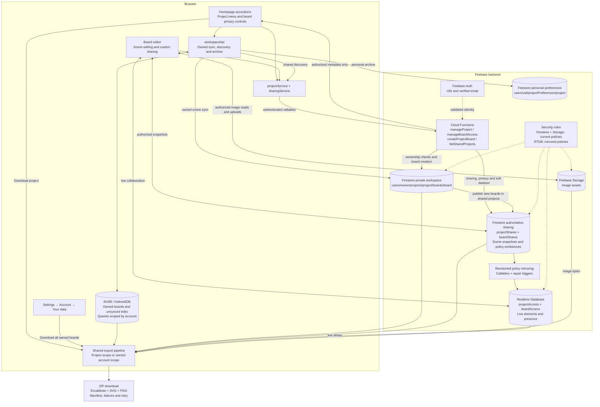
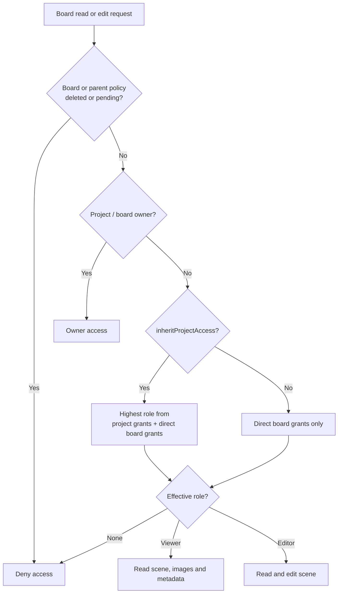
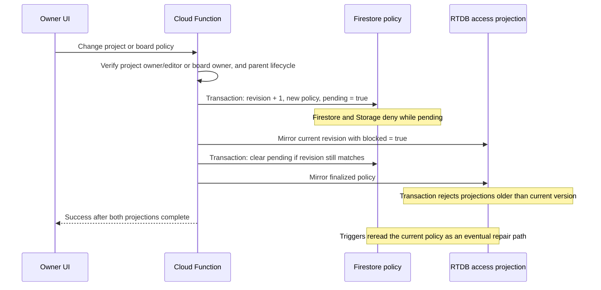
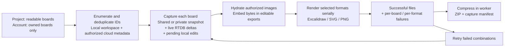

# Projects and bulk downloads: implemented architecture

This describes the implementation in `codex/first-class-projects`. The homepage keeps its existing project accordions; Settings adds the account download entry point.

The sharing documents are the authority for access. Private workspace documents remain under the project owner's UID, even when an editor creates a board. Recipients receive authorized board metadata; scenes and assets are loaded when needed and are not imported into their owned RxDB workspace. Owner sync uses the private documents; collaboration and shared exports read the shared scene snapshots and live deltas.

Personal archive writes only the current user's preferences, with a localStorage cache. It changes homepage visibility without changing any project or board grants. Soft deletion retains content and a policy tombstone; every child board remains subject to the parent deletion gate, including boards with custom access.

## Sharing dialogs and homepage updates

Projects and boards use the same `ShareModal`; projects supply their save action and filtered homepage URL. The workspace retains project policies and account-scoped board policies from its Firestore reads. Board loading also retains either the authorized policy or a verified restricted default when no share document exists. Opening a known share dialog does not fetch permissions again or restore scene images. Explicit service reads remain fresh, and every mutation still runs through backend authorization. Project management accepts the current owner or editor; individual board management requires its owner.

Sharing metadata lives in `projectShares` / `boardShares`, separately from private workspace documents. `boardShares` also contains the shared scene, so a Firestore document read still transfers that scene; caching the policy avoids a duplicate modal read but does not introduce a lightweight metadata projection. Images are not fetched to initialize the dialog. Account changes discard late policy reads rather than caching them under the new identity.

Project menus use vertical dots and nonmodal dropdowns, allowing homepage scrolling. Rename patches the query cache after the committed save. Archive updates the personal view immediately, rolls back failed writes, and exposes Unarchive in the archived view. Rename and download dialogs reuse board-sharing typography and footer controls; format selection reuses the homepage filter checkboxes. Download status and retry occupy reserved space to avoid height changes. ZIP filenames include the project name and date. PNG/SVG use the saved canvas background, with opaque white for missing or transparent backgrounds; editable scene data retains its original background.

## How board access is decided

Project owners and editors can manage project sharing, rename, and soft deletion. The server resolves the original owner’s private project and rechecks editor access inside the policy/rename transaction, without transferring ownership. Viewers cannot manage projects. Individual board sharing, privacy, and deletion remain owner-only. **Make private** sets inheritance to false, clears invitations and disables public links. **Use project access** restores inheritance; it does not restore invitations removed by Make private. Email invitation grants require a verified email.

## How a sharing or privacy change crosses databases

There is no cross-database transaction. Pending gates and monotonically increasing projection versions coordinate changes; the UI reports errors instead of claiming success early. A failed transition can leave access blocked until an owner retry or repair completes.

## Live access recovery and sharing calls

A project policy transition temporarily blocks Firestore/Storage and mirrors the pending state into RTDB. Firestore can terminate snapshot listeners during that denial. The client stays denied while retrying authorization with bounded backoff, then reconnects terminated board/parent listeners and applies the newly effective role. Cleanup cancels retries and ignores late reads. Direct board grants do not require project membership; a denied parent listener rechecks the board instead of revoking a valid direct grant. Restoring the canvas uses its current elements/files, preserving pending edits through the temporary denied view.

Sharing changes autosave once. Done performs no extra policy write after a successful autosave. Project policy changes skip already-published boards; first publication flushes pending workspace data once before publishing missing boards. Board sharing sends only policy metadata to its callable; the backend preserves its canonical scene. Tests assert no board mutations for an existing project update and no repeat save on Done. Server acknowledgment of the Firestore/RTDB access transition is still required before controls re-enable.

## How bulk export works

Export does not publish local changes or alter sharing. Cancellation and account-change checks stop further processing. Snapshot consistency is per board; another device's offline edits are unavailable. The archive has a 256 MB uncompressed-content limit and PNG dimensions are capped at 8192. Shared listings currently refresh every ten seconds; large-project listing/publication pagination remains a scale limitation.

Implementation entry points:

- UI: `workspace-home.tsx`, `project-actions.tsx`, `download-boards-modal.tsx`, `settings-page.tsx`.
- Client data and permissions: `workspace-api.ts`, `project-service.ts`, `sharing-service.ts`.
- Backend policy and discovery: `functions/src/project-access.ts`.
- Export: `apps/whiteboard/src/features/workspace/export-boards.ts`.
- Enforcement: `firestore.rules`, `storage.rules`, `database.rules.json`.

See [requirements and rollout instructions](projects-and-bulk-download.md) for the preserved product decisions and migration order.
