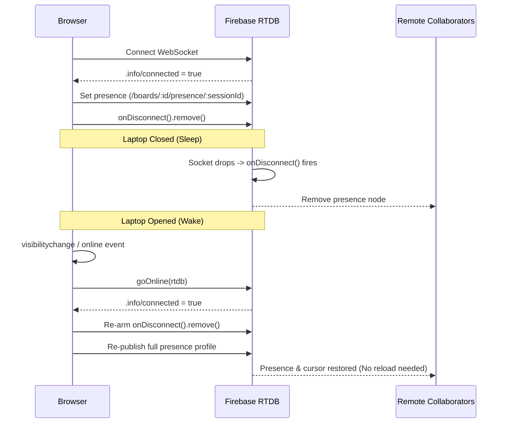

# Real-Time Multi-User Collaboration Architecture

## 1. Executive Summary

This document details the complete end-to-end design, evolution, implementation, testing, and infrastructure constraints of the **Real-Time Multi-User Collaboration** system for Open Excalidraw.

The feature turns a standalone browser whiteboard into a collaborative workspace supporting:

- Concurrent multi-user drawing with zero canvas flicker.
- Anonymous visitor collaboration with deterministic profiles (`Anonymous Mumbai`, `Anonymous Seoul`).
- Live remote cursors, active collaborator presence, and selection indicators.
- User-scoped undo/redo (`Ctrl+Z` only reverts what the author drew).
- Deterministic conflict resolution on simultaneous element mutations.
- Multi-monitor / multi-tab support for the same authenticated user.
- Automatic sleep/wake network recovery without page reloads.
- Production readiness on the Firebase Free (Spark) tier with built-in quota protections.

---

## 2. Discovery & Evolution

### The Problem Space

Collaborative whiteboards present distinct challenges that standard web CRUD cannot handle:

1. **High-Frequency Ephemeral Data:** Mouse movements stream at 60–120Hz. Storing these in document databases exhausts write quotas within minutes.
2. **State Convergence:** Two peers moving or editing the same shape simultaneously must converge to the identical state without losing data or entering infinite update loops.
3. **Identity & Authorization:** Anyone with an invite link should be able to join and draw immediately without forced sign-up, yet the database must be secured against unauthenticated spam bots.
4. **Undo Isolation:** In a shared canvas, global undo is disastrous. If User A draws a circle, User B moves a rectangle, and User A hits `Ctrl+Z`, only User A's circle should disappear.

### Key Investigations & Solutions

#### A. The Database Choice: Realtime Database (RTDB) vs Cloud Firestore

- **Firestore Constraints:** Firestore enforces a hard rate limit of **1 write per second per document** and charges per document write. Streaming cursor positions or element deltas into Firestore would rapidly trigger rate-limit throttling and exhaust the 20,000 writes/day free tier in under an hour.
- **RTDB Architecture:** Firebase Realtime Database uses persistent WebSockets, charges for bandwidth (egress) rather than individual operations, and handles ~1,000 writes/second easily.
- **Decision:** Split the architecture into two tiers:
  - **Cloud Firestore:** Durable board metadata, workspace structure, and sharing permissions.
  - **Firebase RTDB:** High-frequency live canvas elements, remote cursors, and presence heartbeats.

#### B. The "Saving... then Synced" Initial Mount Race

- **Symptom:** Opening any board on localhost or production briefly flashed "Saving..." before transitioning to "Synced".
- **Investigation:** On initial mount, the local canvas initialized with an empty or default revision while the cloud snapshot was still fetching. The sync engine mistook this local initialization for an unsaved user edit and attempted an immediate write-back to cloud storage.
- **Fix:** Introduced an explicit `hasUserInteracted` guard and initial sync hydration gate. Cloud state now populates first; only user-triggered mutations mark the canvas dirty.

#### C. The Duplicate Avatar & Initials Problem

- **Symptom:** Collaborators showed up twice—once in our custom header bar and once in Excalidraw's built-in collaborator footer next to the library icon. Furthermore, the local user saw their own name in the collaborator row, and avatar initials used arbitrary random characters.
- **Fix:**
  - Filtered the active collaborator list to exclude the local user (`u.userId !== currentUserId`).
  - Suppressed Excalidraw's built-in footer presence component via CSS targeting (`.excalidraw .layer-ui__wrapper__footer-right .userList`).
  - Standardized initials formatting: `A` + First letter of the assigned city (e.g. `AS` for _Anonymous Seoul_, `AM` for _Anonymous Mumbai_).

#### D. The Overnight Sleep / Multi-Monitor Wake Discovery

- **Symptom:** When a laptop was closed overnight with boards open across multiple monitors, upon waking the users could draw and see updates, but collaborator names and cursors vanished until the pages were manually refreshed.
- **Investigation:** RTDB detected the socket disconnect and purged the presence node via `onDisconnect().remove()`. When the laptop woke, the client re-established the socket connection for element listeners, but never re-announced its presence node.
- **Fix:** Added event listeners on `window.addEventListener('online')` and `document.addEventListener('visibilitychange')`, combined with RTDB's `.info/connected` hook. On reconnect, the client automatically re-arms `onDisconnect` and re-publishes its complete presence profile.

---

## 3. System Architecture & Data Model

```
┌─────────────────────────────────────────────────────────────┐
│                       Client Browser                        │
│                                                             │
│  ┌───────────────────────┐       ┌───────────────────────┐  │
│  │    Excalidraw API     │       │   useCollaboration    │  │
│  │  (Canvas, Scene State)│◄─────►│    (React Hook)       │  │
│  └───────────────────────┘       └───────────┬───────────┘  │
│                                              │              │
│                                  ┌───────────▼───────────┐  │
│                                  │ CollaborationService  │  │
│                                  └───────────┬───────────┘  │
└──────────────────────────────────────────────┼──────────────┘
                                               │ WebSockets
                    ┌──────────────────────────┴──────────────────────────┐
                    ▼                                                     ▼
     ┌────────────────────────────┐                        ┌────────────────────────────┐
     │ Firebase Realtime Database │                        │       Cloud Firestore      │
     │                            │                        │                            │
     │ /boards/$id/elements       │                        │ /workspaces                │
     │ /boards/$id/presence       │                        │ /boards (metadata)         │
     │ /.info/connected           │                        │ /invitations               │
     └────────────────────────────┘                        └────────────────────────────┘
```

### Realtime Database Schema

```json
{
  "boards": {
    "<boardId>": {
      "elements": {
        "<elementId>": {
          "id": "rect_123",
          "type": "rectangle",
          "x": 250,
          "y": 180,
          "width": 120,
          "height": 80,
          "version": 4,
          "versionNonce": 194827104,
          "lastModifiedBy": "firebase_uid_abc",
          "isDeleted": false
        }
      },
      "presence": {
        "<sessionId>": {
          "userId": "firebase_uid_abc",
          "sessionId": "firebase_uid_abc_k7z9q1",
          "displayName": "Anonymous Seoul",
          "color": "#3B82F6",
          "cursor": { "x": 310, "y": 200 },
          "selectedElementIds": { "rect_123": true },
          "updatedAt": 1727254800000
        }
      }
    }
  }
}
```

### Identity & Authentication Flow

1. **Silent Anonymous Authentication:**
   On initial mount, if `auth.currentUser` is null, the app silently calls `signInAnonymously(auth)`.
   - Every user gets a valid Firebase UID and JWT token.
   - RTDB security rules can enforce `auth != null`, rejecting unauthenticated public bots.
   - Subscriptions are held behind an `isAuthReady` gate to prevent permission race conditions.
2. **Account Upgrading:**
   If an anonymous collaborator signs in with Google, `linkWithCredential(auth.currentUser, credential)` promotes the account without altering their UID, preserving access to boards and element history.
3. **Deterministic Profile Hashing:**
   The Firebase `uid` is passed through a numeric hash to select:
   - A human-friendly city name from a curated 24-city list (`CITIES`).
   - A high-contrast color from a designated 12-color palette (`COLLAB_COLORS`).
   - Initials: `A` + First letter of city (`Anonymous Mumbai` $\rightarrow$ `AM`).
4. **Session Identifier (`sessionId`):**
   Presence keys are stored as `${uid}_${randomSessionId}`. This allows the same user to have multiple tabs or monitors open on the same board without kicking out their own presence.

---

## 4. Concurrency & Canvas Algorithms

### A. User-Scoped Undo / Redo (`performScopedUndo`)

Standard Excalidraw undo reverts whatever was most recently mutated on the canvas. In collaborative environments, this causes "undo theft" (reverting a peer's work).

- **Implementation:**
  - `useCollaboration` maintains an author-scoped history stack:
    $$\text{historyEntry} = \{\; \text{elementId}, \; \text{previousSnapshot}, \; \text{authorUid} \;\}$$
  - When the user presses `Ctrl+Z` (or triggers undo), the engine walks backwards through the stack, finds the most recent mutation where `lastModifiedBy === currentUserId`, restores that specific element's prior state, increments its `version`, assigns a new `versionNonce`, and broadcasts it to RTDB.
  - Co-worker elements remain untouched.

### B. Concurrent Mutation & Deterministic Nonce Tie-Breaking

When two users move or resize the exact same shape simultaneously:

1. **Primary Check:** Higher `version` wins.
2. **Tie-Break:** If both users commit changes with the exact same `version`, Excalidraw standard dictates that the **lowest `versionNonce` wins**.
3. **Server Convergence Re-assertion:**
   Because RTDB is a last-write-wins key-value store, Bob's losing write (higher nonce) could arrive at the server a few milliseconds after Alice's winning write.
   To prevent permanent desync:
   ```ts
   if (localElement.version === remoteElement.version && localElement.versionNonce < remoteElement.versionNonce) {
     // Local element won the tie-break, re-assert winning state to RTDB
     collabService.broadcastChanges([localElement])
   }
   ```
   All clients and the RTDB server converge on the identical element state.

### C. Z-Index Stability via Fractional Indexing

Excalidraw maintains stacking order via array position and fractional indices (`fractionalIndex`). Inserting or moving elements calculates an index between neighbors rather than re-indexing the whole canvas, preserving visual depth across concurrent writers.

### D. Soft Deletion & Tombstones

- Active elements are never hard-deleted from RTDB during live sessions. Hard deletion causes race conditions where a peer with an in-flight move resurrects the deleted shape.
- Deletions set `isDeleted: true` and increment the `version`.
- Late-joining clients read the tombstone and Excalidraw safely marks it invisible.

### E. Payload Ceiling (256KB)

Every outgoing element is checked prior to RTDB dispatch. Elements exceeding 256KB (such as accidentally pasted massive SVG blobs or malicious payloads) are caught and rejected by `cleanPayload()`, protecting RTDB bandwidth.

---

## 5. Network Lifecycle & Self-Healing



1. **Server Disconnects:** `onDisconnect().remove()` runs server-side on Firebase if a client crashes, closes the tab, or loses power.
2. **Stale Heartbeat Pruner:** `subscribeToPresence` runs a client-side scan every 5 seconds. Any collaborator whose `updatedAt` is older than 15 seconds without a disconnect event is cleaned up locally.
3. **Sleep/Wake Reconnection:**
   - Listens to `document.visibilitychange` and `window.online`.
   - Forces `goOnline(rtdb)` on wake.
   - When `.info/connected` fires `true`, immediately republishes the current user profile, cursor, and selection state.

---

## 6. Testing Strategy & Test Suites

The collaboration module is verified through automated test suites:

### Suite 1: Live Multi-Browser Puppeteer E2E Suite

- **File:** `tests/e2e-collab-suite.mjs`
- **Command:** `pnpm test:e2e:collab`
- **Execution:** Launches multiple Google Chrome browser instances with isolated profiles, connects them to the application running on `localhost:5173`, and interacts directly with the canvas and DOM.
- **Scenarios Tested (9/9 Passed):**
  1. _Anonymous Visitor Setup & Avatar Initials:_ Host verifies anonymous guest presence and initial badge `A[CityInitial]`.
  2. _Real-time Remote Cursor Broadcast:_ Guest moves pointer; Host verifies remote cursor coordinates.
  3. _User-Scoped Undo Isolation:_ Both users draw; Host undos; only Host's shape disappears.
  4. _Concurrent Conflict Tie-Break:_ Simultaneous mutation on the same element converges to the lowest `versionNonce`.
  5. _Soft Deletion Tombstones:_ Deleting an element broadcasts `isDeleted: true` without element resurrection.
  6. _256KB Payload Protection:_ Oversized payloads rejected before network broadcast.
  7. _Multi-Tab Self-Collaboration:_ Two tabs under the same account coexist with separate session IDs.
  8. _Sleep/Wake Auto-Recovery:_ Simulates socket drop and verifies presence re-establishment on wake.
  9. _Ghost Cursor Cleanup:_ Tab unmount triggers clean disconnect and removes remote cursor.

### Suite 2: Architectural Edge-Case Simulation Suite

- **File:** `tests/collab-edge-cases.test.ts`
- **Command:** `pnpm test:collab`
- **Execution:** Headless TypeScript test harness executing unit assertions on algorithms.
- **Scenarios Tested (11/11 Passed):**
  - Deterministic profile hashing & color distributions.
  - User-scoped undo history stack manipulation.
  - Nonce tie-breaking reconciliation.
  - Fractional ordering and Z-index stability.
  - Stale presence timeout pruning (>15s).
  - Multi-tab session ID uniqueness.
  - Delta synchronization replay.
  - Malicious payload rejection (>256KB).
  - Image decoupling & snapshot compaction.
  - Non-anonymous profile resolution & RTDB undefined-key stripping.
  - Self-healing presence validation.

---

## 7. Infrastructure, Quotas & Rate Limits

The production app is deployed on **Firebase Spark (Free Tier)**.

### Resource Limits & App Impact

| Service              | Spark Free Limit                | Application Impact                                                                          | Built-in Mitigation                                                                |
| :------------------- | :------------------------------ | :------------------------------------------------------------------------------------------ | :--------------------------------------------------------------------------------- |
| **RTDB Connections** | **100 concurrent**              | **Hard limit.** At most 100 browser tabs can be connected across all boards simultaneously. | `onDisconnect().remove()` instantly frees connections on tab close.                |
| **RTDB Egress**      | **10 GB / month** (~330 MB/day) | Bandwidth scales with: $\text{users} \times \text{updates} \times \text{payload size}$.     | Pointer throttled to 50ms; only delta elements broadcasted; 256KB payload ceiling. |
| **RTDB Storage**     | **1 GB total**                  | Canvas JSON data in RTDB.                                                                   | Only active elements stored; deleted tombstones compacted.                         |
| **Firestore Writes** | **20,000 / day**                | Board metadata and invitations.                                                             | High-frequency drawing offloaded to RTDB; Firestore untouched during drawing.      |
| **Firestore Limits** | **1 write/sec/doc**             | Board document updates.                                                                     | Completely bypassed for drawing by using RTDB.                                     |
| **Auth Sign-ups**    | **~100 / IP / hour**            | Anonymous visitors creating accounts.                                                       | Re-uses existing anonymous credentials across sessions via localStorage/IndexedDB. |
| **Hosting Transfer** | **10 GB / month**               | Serving static JS/CSS assets.                                                               | Production asset caching and gzip/brotli compression (~3MB build).                 |

### Upgrade Path

If concurrent usage exceeds 100 simultaneous tabs:

- Upgrading to the **Firebase Blaze (Pay-as-you-go) Plan** requires **no code changes**.
- Blaze retains the same free allowances each month (first 1GB storage and 10GB egress remain free).
- Simultaneous connection limit increases from 100 to **200,000 per database**.

---

## 8. File Directory & Codebase Map

| File Path                                                                                                                                                                                                      | Description                                                                                                                         |
| :------------------------------------------------------------------------------------------------------------------------------------------------------------------------------------------------------------- | :---------------------------------------------------------------------------------------------------------------------------------- |
| [`apps/whiteboard/src/features/collaboration/use-collaboration.ts`](file:///Users/karan/projects/Personal_projects/agentic-whiteboard/apps/whiteboard/src/features/collaboration/use-collaboration.ts)         | Primary React hook orchestrating presence, subscriptions, user-scoped undo, conflict tie-breaking, and DEV test harnesses.          |
| [`apps/whiteboard/src/features/collaboration/collaboration-service.ts`](file:///Users/karan/projects/Personal_projects/agentic-whiteboard/apps/whiteboard/src/features/collaboration/collaboration-service.ts) | Core RTDB communication service handling WebSockets, throttled pointer updates, delta broadcasting, and `.info/connected` recovery. |
| [`apps/whiteboard/src/features/collaboration/anonymous-user.ts`](file:///Users/karan/projects/Personal_projects/agentic-whiteboard/apps/whiteboard/src/features/collaboration/anonymous-user.ts)               | Anonymous Firebase auth handler, profile generation, city hashing, and session ID generation.                                       |
| [`apps/whiteboard/src/features/collaboration/collaborator-bar.tsx`](file:///Users/karan/projects/Personal_projects/agentic-whiteboard/apps/whiteboard/src/features/collaboration/collaborator-bar.tsx)         | Header avatar stack displaying active collaborators with city initials, online status dots, and local user filtering.               |
| [`apps/whiteboard/src/features/collaboration/types.ts`](file:///Users/karan/projects/Personal_projects/agentic-whiteboard/apps/whiteboard/src/features/collaboration/types.ts)                                 | TypeScript interfaces for presence, collaborator state, and element updates.                                                        |
| [`apps/whiteboard/src/routes/board-editor.tsx`](file:///Users/karan/projects/Personal_projects/agentic-whiteboard/apps/whiteboard/src/routes/board-editor.tsx)                                                 | Editor view wiring `useCollaboration` into the Excalidraw imperative API and rendering the collaborator bar.                        |
| [`apps/whiteboard/src/styles.css`](file:///Users/karan/projects/Personal_projects/agentic-whiteboard/apps/whiteboard/src/styles.css)                                                                           | Custom styling and suppression rules for Excalidraw's default built-in presence list.                                               |
| [`database.rules.json`](file:///Users/karan/projects/Personal_projects/agentic-whiteboard/database.rules.json)                                                                                                 | Firebase Realtime Database security rules enforcing authentication on boards and presence trees.                                    |
| [`tests/e2e-collab-suite.mjs`](file:///Users/karan/projects/Personal_projects/agentic-whiteboard/tests/e2e-collab-suite.mjs)                                                                                   | Live multi-browser Puppeteer E2E test suite running 9 live scenarios.                                                               |
| [`tests/collab-edge-cases.test.ts`](file:///Users/karan/projects/Personal_projects/agentic-whiteboard/tests/collab-edge-cases.test.ts)                                                                         | Concurrency and algorithmic edge case test suite running 11 unit checks.                                                            |
